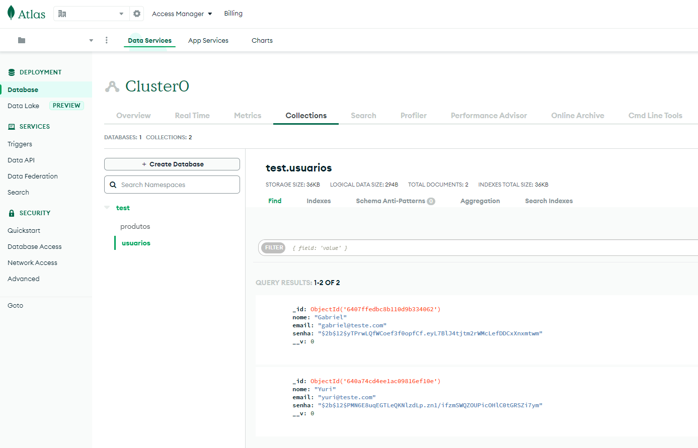

<h1 align="center"> 🚧 Projeto em desenvolvimento 🚧</h1>

# Sobre o projeto

O objetivo do projeto é colocar em prática e desenvolver novos conhecimentos. A ideia é uma aplicação Fullstack de um e-commerce de produtos eletrônicos onde poderá ser realizado o cadastro de usuário, login e a visualização dos produtos. Além disso, ter a função de **inserir**, **editar** e **excluir** produtos através do perfil de admin.

# Organização 

### Dentro da pasta backend temos as pastas "controllers", "middlewares", "models" e "routes"
- 📁 **controllers** é onde possui arquivos com códigos que se comunicam diretamente com o banco de dados. (Verifica se existe no banco de dados e instancia o objeto)
- 📁 **middlewares** é onde ficam as verificações das informações fornecidas. (Se todos os campos foram preenchidos, se as senhas são idênticas etc)
- 📁 **models** é onde ficam armazenados os modelos das collections(tabelas) do banco de dados
- 📁 **routes** é onde estão as rotas. Os arquivos contidos nela têm como responsabilidade determinar o método HTTP utilizado em cada rota e também recebem os **middlewares** e os **controllers**

### Features

- [x] Cadastro de usuários (backend)
- [x] Cadastro de produtos (backend)
- [x] Login de usuário com autenticação
- [ ] Filtragem de produtos
- [ ] Rota com acesso restrito

### ⚠ Pré-requisitos
Para você conseguir executar o projeto na sua máquina e testá-lo, deverão estar instaladas as seguintes ferramentas: <br>
- <a href="https://nodejs.org/en/">NodeJS</a> para instalar dependências e rodar o localhost.
- <a href="https://insomnia.rest/download">Insomnia</a> ou <a href="https://www.postman.com/">Postman</a> para o uso dos métodos HTTP
### 👩‍💻 Rodando o Back End (servidor)
1 - Clone este repositório
```sh
$ git clone https://github.com/GabeOP/e-commerce.git
```

2 - Entre na pasta 'backend'
```sh
$ cd backend
```

3 - Instale as dependências que estão listadas no arquivo package.json
```sh
$ npm install
```

4 - Execute o servidor
```sh
$ node index.js
```


# Tecnologias utilizadas

- NodeJS
- ExpressJS
- Javascript
- ReactJS
- MongoDB

---

Para o banco de dados, decidimos utilizar o **MongoDB** pois queríamos ter melhor entendimento do funcionamento e expandir o conhecimento além do MySQL. Os dados cadastrados são inseridos no banco de dados na nuvem (**MongoDB Atlas**). Repare também que a senha cadastrada é enviada para o banco de dados já encriptada. Graças ao <a href="https://www.npmjs.com/package/bcrypt?activeTab=readme">bcrypt</a> que já faz todo esse serviço com funções simples de serem utilizada. Demonstração abaixo 👇


---

### Autores:

Yuri: https://github.com/Yur1sz <br>
Gabriel: https://github.com/GabeOP
